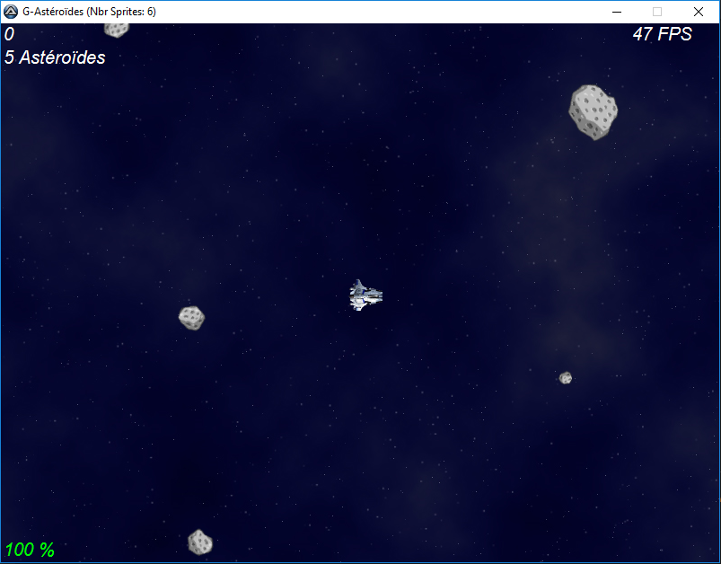

> #  G-Engin
#### Author: [Matwachich](https://github.com/matwachich)
### G-Engin is a simple and complet 2D game development UDF for AutoIt3!

## [:book: Wiki](https://github.com/G-Engin/g-engin/wiki)

## [Samples](Samples)
* [Basic](Samples/Basic.au3)
* [Collisions](Samples/Collisions.au3)
* [Collision With Elasticity](Samples/CollisionWithElasticity.au3)
* [Collision Without Elasticity](Samples/CollisionWithoutElasticity.au3)
* [Collision With Partial Elasticity](Samples/CollisionWithPartialElasticity.au3)
* [Collision With Screen Border](Samples/CollisionWithScreenBorder.au3)
* [Dynamic Moving](Samples/DynamicMoving.au3)
* [Particules (Load Image of Stream)](Samples/Particules.au3)
* [Sound And Animation](Samples/SoundAndAnimation.au3)

## [Sample Games](Samples/Games)
* ### **[Fly Chicken](Samples/Games/FlyChicken)**

> 

* ### **[G-Astéroïdes](Samples/Games/Avion.au3)**

> 

* ### **[Tank Game](Samples/Games/Tank.au3)**

> 

## Tips
> :bulb: Use [Visual Studio Code](https://code.visualstudio.com/) along with [AutoIt](https://marketplace.visualstudio.com/items?itemName=Damien.autoit) and [G-Engin](https://marketplace.visualstudio.com/items?itemName=RonildoSouza.g-engin) extensions to make it easy to develop your games.
